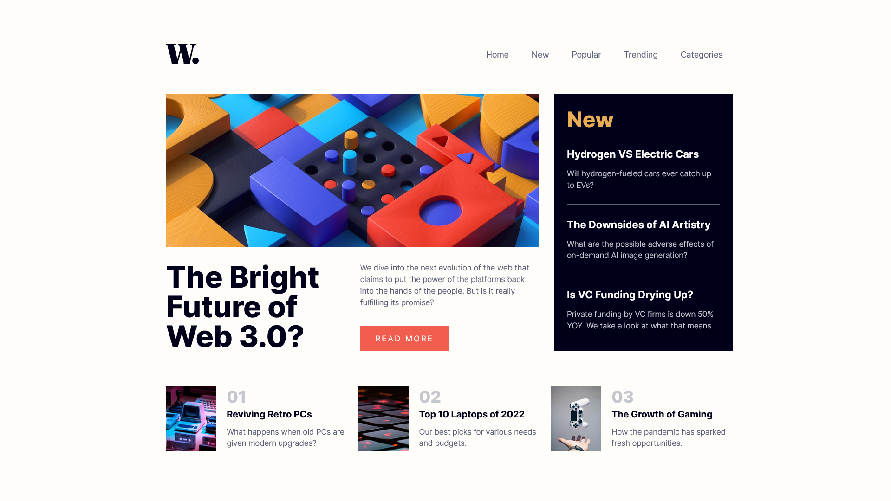

# Frontend Mentor - News homepage solution

This is a solution to the [News homepage challenge on Frontend Mentor](https://www.frontendmentor.io/challenges/news-homepage-H6SWTa1MFl). Frontend Mentor challenges help you improve your coding skills by building realistic projects. 

## Table of contents

- [Overview](#overview)
  - [The challenge](#the-challenge)
  - [Screenshot](#screenshot)
  - [Links](#links)
- [My process](#my-process)
  - [Built with](#built-with)
  - [Useful resources](#useful-resources)
- [Author](#author)

## Overview

### The challenge

Users should be able to:

- View the optimal layout for the interface depending on their device's screen size
- See hover and focus states for all interactive elements on the page

### Screenshot

### Links

- Solution URL: [GitHub](https://github.com/Fayozxon/fem-news-page/)
- Live Site URL: [Live Site](https://fem-news-page.netlify.app/)

## My process

### Built with

- Semantic HTML5 markup
- CSS custom properties
- Flexbox
- CSS Grid
- Desktop-first workflow
- [Google Fonts](https://fonts.google.com/) - Font library

### Useful resources

- [CSS Grid crash course](https://youtu.be/YNB-JD7iPoQ) - This helped me build custom css layouts easily. I really liked this pattern and will use it going forward.

## Author

- Frontend Mentor - [@Fayozxon](https://www.frontendmentor.io/profile/Fayozxon)
- Telegram - [@fayozhons](https://www.t.me/fayozhons)
